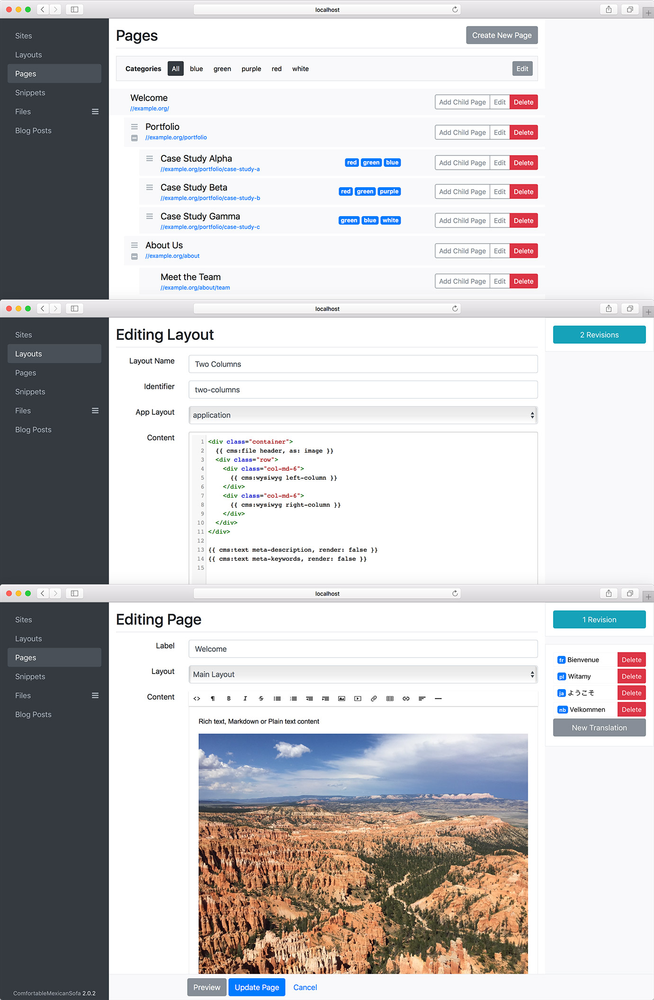

# ComfortableMexicanSofa

ComfortableMexicanSofa is a powerful Ruby on Rails 5.2+ CMS (Content Management System) Engine

[](http://rubygems.org/gems/comfortable_mexican_sofa)
[](http://rubygems.org/gems/comfortable_mexican_sofa)
[](https://travis-ci.org/comfy/comfortable-mexican-sofa)
[](https://gemnasium.com/comfy/comfortable-mexican-sofa)
[](https://codeclimate.com/github/comfy/comfortable-mexican-sofa)
[](https://coveralls.io/r/comfy/comfortable-mexican-sofa?branch=master)
[](https://gitter.im/comfy/comfortable-mexican-sofa)

## Features

* Simple drop-in integration with Rails 5.2+ apps with minimal configuration
* CMS stays away from the rest of your application
* Powerful page templating capability using [Content Tags](https://github.com/comfy/comfortable-mexican-sofa/wiki/Docs:-Content-Tags)
* [Multiple Sites](https://github.com/comfy/comfortable-mexican-sofa/wiki/Docs:-Sites) from a single installation
* Multi-Language Support (i18n) (ca, cs, da, de, en, es, fr, gr, it, ja, nb, nl, pl, pt-BR, ru, sv, tr, uk, zh-CN, zh-TW) and page localization.
* [CMS Seeds](https://github.com/comfy/comfortable-mexican-sofa/wiki/Docs:-CMS-Seeds) for initial content population
* [Revision History](https://github.com/comfy/comfortable-mexican-sofa/wiki/Docs:-Revisions) to revert changes
* [Extendable Admin Area](https://github.com/comfy/comfortable-mexican-sofa/wiki/HowTo:-Reusing-Admin-Area) built with [Bootstrap 4](http://getbootstrap.com) (responsive design). Using [CodeMirror](http://codemirror.net) for HTML and Markdown highlighing and [Redactor](http://imperavi.com/redactor) as the WYSIWYG editor.

## Dependencies

* File attachments are handled by [ActiveStorage](https://github.com/rails/rails/tree/master/activestorage). Make sure that you can run appropriate migrations by running: `rails active_storage:install`
* Image resizing is done with with [ImageMagick](http://www.imagemagick.org/script/download.php), so make sure it's installed.
* Pagination is handled by [kaminari](https://github.com/amatsuda/kaminari) or [will_paginate](https://github.com/mislav/will_paginate). Please add one of those to your Gemfile.

## Installation

Add gem definition to your Gemfile:

```ruby
gem 'comfortable_mexican_sofa', '~> 2.0.0'
```

Then from the Rails project's root run:

    bundle install
    rails generate comfy:cms
    rake db:migrate

Now take a look inside your `config/routes.rb` file. You'll see where routes attach for the admin area and content serving. Make sure that content serving route appears as a very last item or it will make all other routes to be inaccessible.

```ruby
comfy_route :cms_admin, path: "/admin"
comfy_route :cms, path: "/"
```

## Quick Start Guide

After finishing installation you should be able to navigate to http://localhost:3000/admin

Default username and password is 'username' and 'password'. You probably want to change it right away. Admin credentials (among other things) can be found and changed in the cms initializer: [/config/initializers/comfortable\_mexican\_sofa.rb](https://github.com/comfy/comfortable-mexican-sofa/blob/master/config/initializers/comfortable_mexican_sofa.rb)

Before creating pages and populating them with content we need to create a Site. Site defines a hostname, content path and its language.

After creating a Site, you need to make a Layout. Layout is the template of your pages; it defines some reusable content (like header and footer, for example) and places where the content goes. A very simple layout can look like this:

```html
<html>
  <body>
    <h1>{{ cms:text title }}</h1>
    {{ cms:wysiwyg content }}
  </body>
</html>
```

[See Wiki entry on available Tags you can use](https://github.com/comfy/comfortable-mexican-sofa/wiki/Docs:-Content-Tags)

Once you have a layout, you may start creating pages and populating content. It's that easy.

For more information please refer to [Wiki](https://github.com/comfy/comfortable-mexican-sofa/wiki).



#### Old Versions

CMS for Rails 5.1 doesn't have published gem, but you may use [rails 5.1 branch](https://github.com/comfy/comfortable-mexican-sofa/tree/rails5.1) directly.

With Rails 4.2 and 5.0 use gem version [1.12.10](https://rubygems.org/gems/comfortable_mexican_sofa/versions/1.12.10)

With Rails 3.0 use gem version [1.8.5](https://rubygems.org/gems/comfortable_mexican_sofa/versions/1.8.5)

#### Contributing

ComfortableMexicanSofa repository can be ran like a regular Rails application in
development environment. It's as easy to work on as any other Rails app out there.
For more detail take a look at [CONTRIBUTING](CONTRIBUTING.md)

#### Help and Contact

Gitter: https://gitter.im/comfy/comfortable-mexican-sofa

Twitter: [@GroceryBagHead](https://twitter.com/grocerybaghead)

#### Acknowledgements

Thanks to [Roman Almeida](https://github.com/nasmorn) for contributing OEM License for [Redactor Text Editor](http://imperavi.com/redactor)

---

Copyright 2010-2018 Oleg Khabarov. Released under the [MIT license](LICENSE)
